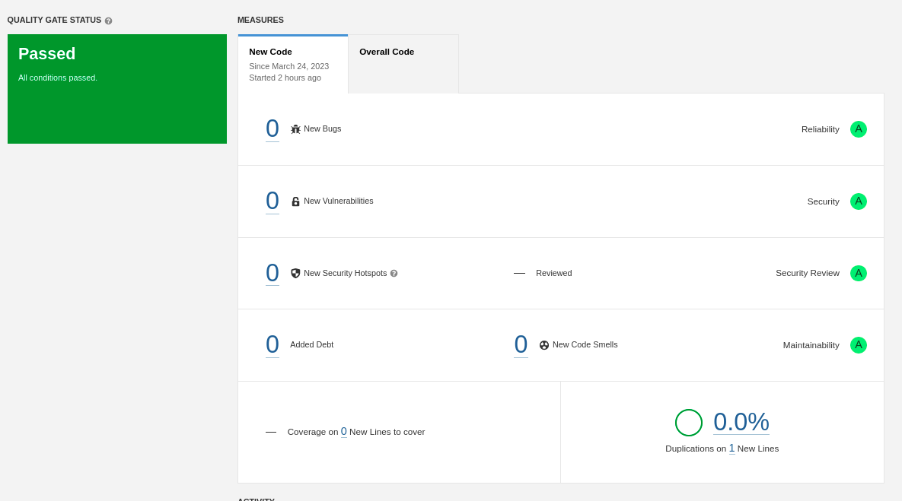

# Lab 6_1 - Local analysis

## f.

The project tested passed the quality gate status as shown in the image above.

## g.

| Issue | Problem description | How to solve |
| ----- | ------------------- | ------------ |
| [CODE SEMELL (major)] Invoke method(s) only conditionally. | Passing message arguments that require further evaluation | Structure code to pass static or pre-computed values. |
| [CODE SEMELL (minor)] Remove this unused import 'java.security.SecureRandom'. | There is an import that's never used. | Deleting the correspondent code line. |
| [CODE SEMELL (major)] Refactor the code in order to not assign to this loop counter from within the loop body. | The loop counter is assigned inside the loop. | Add the loop counter in the loop definition. |